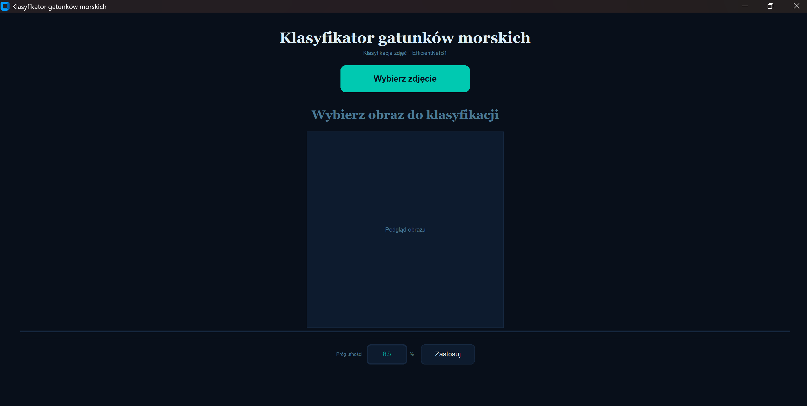
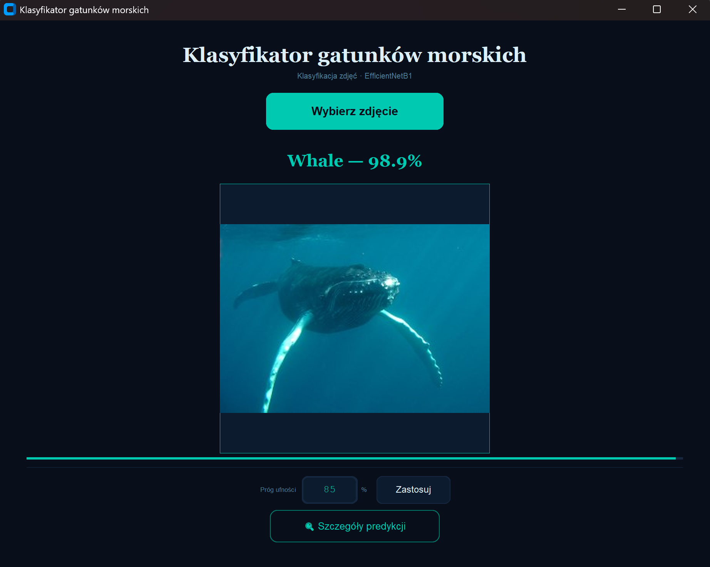

# Marine Species Classification
A Python/Keras project for classifying 13 marine species from images using a Convolutional Neural Network (CNN).

## Project Overview
- **Goal:** Automatically classify images of marine species into 13 categories using deep learning.
- **Workflow:** Data preprocessing → Model training → Evaluation → Prediction → Integration into Python application.
- **Use case:** Portfolio project showcasing practical ML and Python development skills.

## Technologies & Skills

- **Languages & Libraries:** Python, Keras, TensorFlow, NumPy, Pandas, Matplotlib, scikit-learn, OpenCV  
- **Skills:** Image preprocessing, CNN modeling, data processing, Python scripting, problem-solving 

## Notes

- All information regarding dataset structure, preprocessing steps, and project documentation can be found in: **docs/dokumentacja_projektu.pdf**
- Dataset is not included due to size.  
- This repository is intended for portfolio purposes and demonstrates hands-on experience in machine learning.

## Getting Started
### Prerequisites
- Python 3.10+
- pip

### Installation

1. Clone the repository:
```bash
git clone https://github.com/julialuza/Marine-Species-ML.git
cd Marine-Species-ML
```
2. Install dependencies
```bash
pip install -r requirements.txt
```
3. Run app.py.

Application interface:  



Classification example - whale:  




