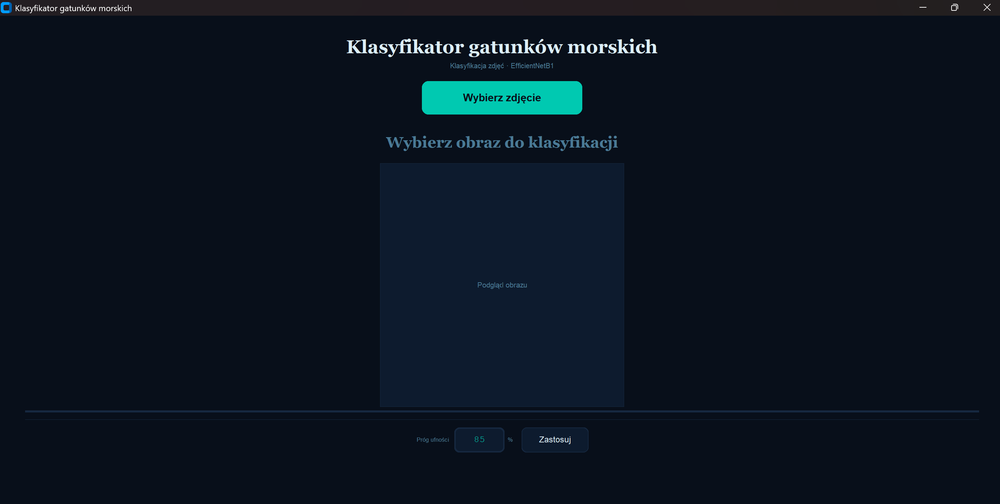
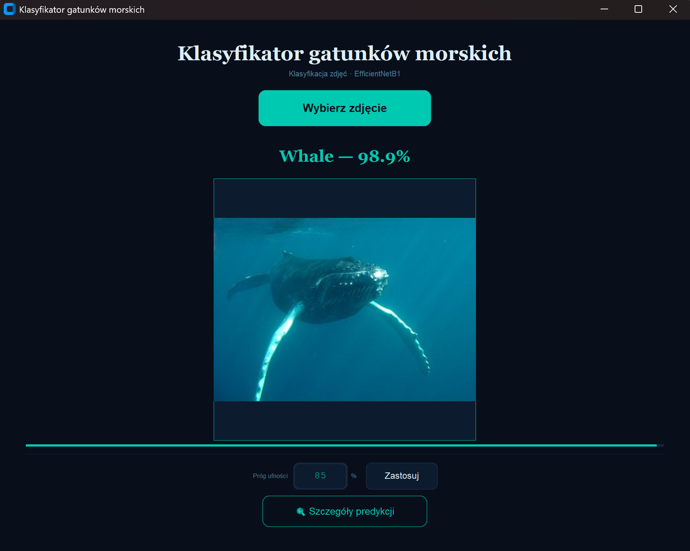

# Marine Species Classification
A deep learning project for classifying 13 marine species from images using a Convolutional Neural Network (CNN).

## Project Overview
This project focuses on building an end-to-end machine learning pipeline for image classification of marine species.

**Key features:**
- Classification of **13 marine species**
- Transfer learning using **EfficientNetB1**
- Custom training pipeline with data augmentation
- Evaluation using classification metrics and visualizations
- Desktop GUI application for real-time predictions

## Technologies & Skills

- **Languages & Libraries:** Python, Keras, TensorFlow, NumPy, Pandas, Matplotlib, scikit-learn, OpenCV  
- **Skills:** Image preprocessing, CNN modeling, data processing, Python scripting, problem-solving 

## Notes

- All information regarding dataset structure, preprocessing steps, and project documentation can be found in: **docs/dokumentacja_projektu.pdf**
- Dataset is not included due to size.

## Demo

### Interface preview

| Before prediction | After prediction |
|------------------|------------------|
|  |  |

### Full application demo

<p align="center">
  
</p>

## Getting Started
### Prerequisites
- Python 3.10+
- pip

### Installation

1. Clone the repository:
```bash
git clone https://github.com/julialuza/Marine-Species-ML.git
cd Marine-Species-ML
```
2. Install dependencies
```bash
pip install -r requirements.txt
```
3. Run run.py.


